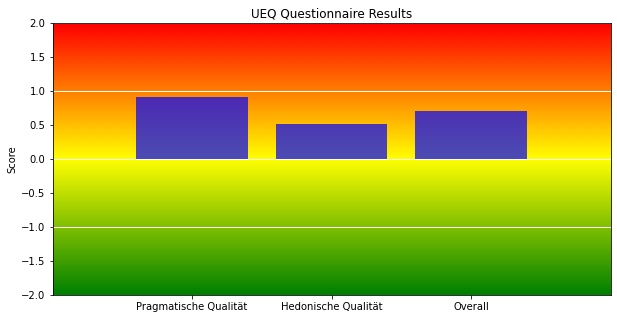

# UEQ-S Implementation in a Python Notebook

This repository contains a Python Notebook implementing the Short User Experience Questionnaire (UEQ-S). The notebook calculates the UEQ-S scores for different aspects such as Pragmatic Quality, Hedonic Quality, and Overall Experience.

You can compare the results with the offical UEQ-S analysis tool in the repository or download it directly from:
https://www.ueq-online.org/Material/Short_UEQ_Data_Analysis_Tool.xlsx


All credits for this analysis goes to the authors from the UEQ-Team:
Andreas Hinderks, Martin Schrepp, Jörg Thomaschewski

For more information visit: https://www.ueq-online.org/
## Results

The UEQ-S scores were calculated based on the responses to the survey. The scores were divided into the following categories:

- **Pragmatic Quality:** 0.903846
- **Hedonic Quality:** 0.519231
- **Overall Experience:** 0.711538

These values can be interpreted based on the UEQ's standard scoring system, with the scores ranging from -0.8 to 0.8, where negative values indicate negative feedback and positive values indicate positive feedback.

## Graphic Representation

The following bar chart represents the above scores with a gradient background, visually representing the transition between negative and positive feedback.



## How to Run the Notebook

You can run the notebook using Jupyter. Make sure you have all the required packages installed:

```bash
pip install pandas matplotlib
